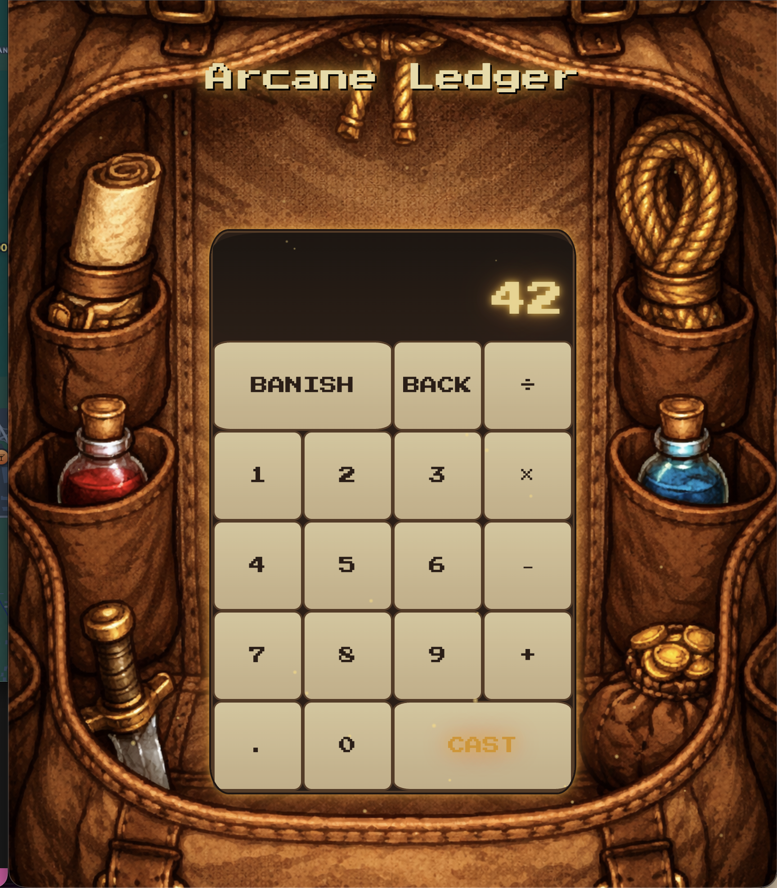

# Arcane Ledger
Arcane Ledger

A fantasy-themed calculator that transforms arithmetic into spellcasting. Instead of pressing "equals," you CAST. Instead of clearing, you BANISH.

Overview
Arcane Ledger started as a standard JavaScript calculator and was progressively redesigned into an immersive retro-fantasy experience. The app is built with vanilla HTML, CSS, and JavaScript — no frameworks or dependencies — and features a rucksack background, glowing pixel-art display, parchment-style buttons, a custom wand cursor, and ambient floating dust particles.

Features

Full arithmetic — addition, subtraction, multiplication, and division
Chained operations — selecting a new operator mid-calculation automatically evaluates the previous expression
Decimal support — guards against duplicate decimal points
BANISH / BACK — clear all input or delete the last digit
Formatted display — numbers rendered with locale-aware comma separators (e.g. 4,567)
Glowing display — warm golden text-shadow on both the current and previous operand outputs
Parchment buttons — gradient button styling with hover glow and active press states
Custom wand cursor — swaps to an alternate wand sprite on click (wand.png → wand2.png)
Ambient dust particles — 50 staggered golden particles float upward continuously; each respawns after its animation ends to keep the scene alive without memory buildup
Press Start 2P font — pixel-art typography loaded via Google Fonts

Tech Stack
TechnologyUsageHTMLApp structure and button layoutCSSFantasy theme, glow effects, particle animation, custom cursorJavaScriptCalculator logic, DOM manipulation, particle systemGoogle FontsPress Start 2P pixel-art font

Project Structure
arcane-ledger/
├── index.html          # App structure and button layout
├── styles.css          # Fantasy theme, animations, particle styles
├── script.js           # Calculator class, event listeners, particle system
└── images/
    ├── rucksack.png    # Background image
    ├── wand.png        # Default cursor sprite
    └── wand2.png       # Active/click cursor sprite

Setup & Usage
No dependencies or build tools required.

Clone the repository:

bash   git clone https://github.com/daphneblum/arcane-ledger.git

Navigate into the project folder:

bash   cd arcane-ledger

Open index.html in your browser:

bash   open index.html
Or simply double-click index.html in your file explorer.

How It Works
Calculator Logic
The app uses an object-oriented Calculator class with the following responsibilities:
MethodDescriptionclear()Resets both operands and the stored operationdelete()Slices the last character from the current operandappendNumber(number)Appends a digit or decimal; guards against duplicate .chooseOperation(operation)Stores the operator; auto-computes if a previous operand already existscompute()Evaluates the stored expression using parseFloat; no-ops on invalid inputgetDisplayNumber(number)Formats integers with toLocaleString while preserving decimal digitsupdateDisplay()Writes formatted values to the two output div elements
Event listeners are attached to all button groups ([data-number], [data-operation], [data-equals], [data-delete], [data-all-clear]) and call updateDisplay() after every interaction.
Particle System
The particle system runs entirely in vanilla JS and CSS with no canvas or external library.

createParticles() spawns 50 particles staggered 300ms apart to avoid a simultaneous burst on load
spawnParticle() creates a div with the .dust-particle class, randomizes its horizontal position (left: 0–100vw), size (2–6px), animation duration (8–18s), and delay (0–5s), then appends it to the body
Each particle listens for animationend — when it fires, the particle is removed from the DOM and spawnParticle() is called again, keeping the screen populated without accumulating unused elements
The floatUp CSS keyframe animation moves particles from translateY(0) to translateY(-100vh) with a slight horizontal drift and a fade-in/fade-out opacity curve

Theming
Two color schemes were explored during development and are preserved as comments in styles.css:

Mystical (purple) — cool purple/violet glows on the display text
Warm (gold) — the current active theme; amber and orange glows matching the rucksack environment

Development Log
Initial build Functional calculator based on Web Dev Simplified tutorial

Visual iteration 1
Added fantasy theming: pixel-art font, parchment buttons, dark display

Visual iteration 2
Switched background to rucksack image, added warm gold glow scheme, integrated particle system and custom wand cursor

3-23-2026
Refined button appearance, added particle effects, background resizing improvements in progress

Planned Improvements

Scale background image responsively across different screen sizes
Additional cosmetic polish to button and display styling

Acknowledgements
Base calculator logic adapted from the tutorial by Web Dev Simplified on YouTube: ![https://www.youtube.com/watch?v=j59qQ7YWLxw]. All fantasy theming, visual design, particle system, and feature extensions by daphneblum.